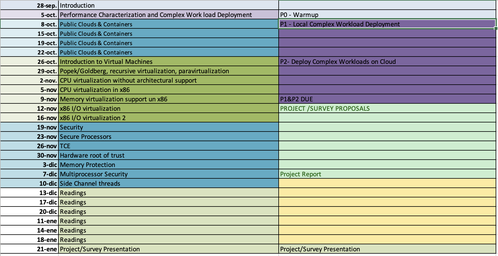

# Lecture Notes of course  [M1689](http://web.unican.es/departamentos/macc/estudios/detalle-asignatura?c=M1689&p=170&a=2016)

## Schedule

## Lecture Notes
* Course Introduction [Slides](01-intro.pdf)
* Performance Evaluation [Slides](02-PERFORMANCE.pdf)
* Virtualization [Slides](03-Virtualization.pdf)
* Xen [Slides](04-Xen.pdf)
* Virtualization Assists [Slides](05-Assist.pdf)
* Performance Tunning in Xen [Slides](06-Acelerated-Xen.pdf)
* Containers [Slides](07-Containers.pdf)
* Public Clouds [Slides](08-PublicClouds.pdf)

## Labs
* Performance Evaluation [Slides](La01-performance.pdf)
* Xen [Slides](Lab02-Xen.pdf)
* Xen [Slides](Lab03-Optimize.pdf)
* Containers and Public Clouds [Slides](La04-containers.pdf)

## Reference
* J. Smith, R. Nair, [Virtual Machines: Versatile Platforms for Systems and Processes](https://www.amazon.es/Virtual-Machines-Versatile-Platforms-Architecture/dp/1558609105)
* C. Takemura, L.Crawford [The Book of Xen: A Practical Guide for the System Administrator](https://www.amazon.es/Book-Xen-Practical-System-Administrator/dp/1593271867)
* [Intel x86_64 Reference](64-ia-32-architectures-software-developer-vol-3b-part-2-manual.pdf)
* [Intel Vanderpool] (06670704.pdf)
